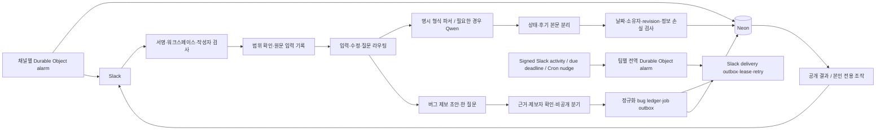
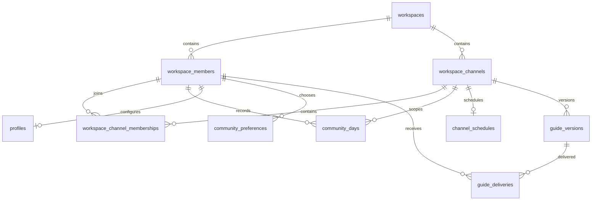

# 시스템 구조

Slack이 입력을 전달하고 Cloudflare Worker가 검증·분류·저장을 맡습니다. Neon PostgreSQL이 기록의 원본이며, Durable Object가 예약과 잔디 갱신 순서를 조정합니다.

## 데이터 원본

| 테이블·뷰 | 책임 |
| --- | --- |
| `workspaces`, `workspace_channels` | 워크스페이스와 채널 식별, 공개 목표 채널 지정 |
| `workspace_members` | 공통 회원 키와 Slack 사람·봇·삭제 상태. 회원 존재 자체가 관리자·초대 권한은 아님 |
| `workspace_channel_memberships` | 완전한 Slack 채널 회원 스냅샷에서 확인한 현재 소속과 마지막 관찰 시각 |
| `community_days` | 회원·채널·날짜별 목표·상태·후기의 유일한 원본 |
| `goals` | 공개 목표 채널만 읽는 호환 뷰. 별도 목표 저장소가 아님 |
| `profiles` | 회원별 잔디 색상·시작일 |
| `community_events` | 변경 전 상태·revision·중복 방지·되돌리기 이력 |
| `community_preferences`, `channel_schedules` | 개인 안내와 공통 일정 |
| `community_milestones` | 첫 등록·첫 완료·첫 후기 이력 |
| `community_records` | 재처리 가능한 입력 원문, 확인 대기·발송·가입 안내 등 워크플로 기록 |
| `community_garden_deliveries` | 날짜 revision별 잔디 게시 outbox, lease·payload digest·재시도·Slack 영수증 |
| `member_introductions` | 회원별 현재 자기소개·선택적 LinkedIn·기타 공개 정보·공개 메시지 위치·revision |
| `guide_versions`, `guide_deliveries` | 안내 본문 버전과 회원별 전달 |
| `bug_reports`, `bug_report_revisions`, `bug_questions` | 제보별 정규화 상태, 제보자만 읽는 revision, 한 질문씩의 답변 이력 |
| `bug_events`, `bug_transition_contract`, `bug_jobs` | 허용 상태 전이, idempotency 이력, 재현·수정·검토·배포 작업 outbox |
| `bug_deliveries` | 질문·요약·접수 영수증·비공개 관리자 인계의 Slack delivery outbox와 lease·재시도·발송 영수증 |
| `bug_artifacts`, `bug_links`, `agent_runs`, `git_changes` | digest로 참조하는 산출물, 중복·회귀 관계, 이후 작업의 관찰 이력 |
| `schema_migrations`, `otl_archive` | 적용 이력과 이관 전 데이터 보존 |

## 변경과 해석 경계

서명과 범위를 통과한 입력은 원문·정규화 본문·대상 날짜·Slack 위치를 먼저 워크플로 기록에 보존합니다. 명확한 후기 헤더는 결정적으로 파싱하고, 저장할 때 `후기:`·`회고:` 머리말을 본문에서 제거합니다. 문장 선두의 명시적 날짜만 대상 날짜로 해석하며 본문의 숫자·시간·버전·과거 이유 표현은 내용으로 보존합니다. 자유로운 표현에는 Qwen을 사용합니다. 모델은 작성자 권한·저장 날짜·보상·퇴장을 결정하지 않습니다.

모델 해석은 곧바로 DB 동작이 되지 않습니다. 결정 계층이 `수행 상태`, `후기 원문`, `확인 필요 여부`, `현재 날짜에 적용해도 되는지`를 별도 값으로 만듭니다. 목표가 있는 날짜의 유효한 후기 원문은 수행 상태가 없더라도 먼저 canonical day에 저장하고 상태·잔디를 게시합니다. 상태 질문은 reflection과 분리된 durable record와 delivery attempt로 관리하며, Slack 전송 실패는 후기를 롤백하지 않습니다. 같은 스레드의 자연어 답변과 소유자·날짜·원문 위치·revision에 묶인 버튼만 pending outcome을 닫을 수 있습니다. 상태만 있는 짧은 문장은 상태만 바꿀 수 있지만, 설명·느낌·배움이 포함될 가능성이 있는 본문은 모델이 완료만으로 축소해도 확인 없이 버리지 않습니다. 명시한 과거 날짜는 오늘 기록 확인으로 바꾸지 않습니다.

저장은 현재 revision을 확인하고 중복 요청 키를 사용합니다. Slack 글 편집은 원래 작성자·채널·스레드를 유지하되 편집 timestamp로 요청을 구분합니다. 상태만 있는 완료는 후기 제출로 만들지 않습니다.

## 게시와 예약

공개 잔디에는 결과만 표시하고 개인 조작은 ephemeral로 보냅니다. 처음에는 네 칸, 참여 기간이 늘면 여덟 칸으로 확장합니다. 아홉째 날부터는 새 페이지로 초기화하지 않고 오늘을 포함한 최근 평일과 참여한 주말을 시간순으로 보여줍니다. 미참여 주말은 숨기며, 오늘 목표는 즉시 연두색으로 나타납니다.

날짜 변경과 같은 트랜잭션에서 revision별 잔디 delivery를 저장합니다. Durable Object는 lease로 이를 claim하고 실패를 최대 세 번 재시도합니다. Slack 응답을 잃으면 스레드의 안정적인 block marker를 먼저 대조해 중복 게시를 막습니다. 새 메시지 영수증을 DB에 저장한 뒤에만 관리 중인 옛 이미지·버튼을 제거하므로, 실패가 기존 이력을 지우지 않습니다.

일반 커뮤니티 예약은 채널별 Durable Object alarm과 DB의 발송 조건·claim을 함께 사용합니다. 공개 수집 시점마다 `conversations.members` 전 페이지와 최대 동시 5개의 `users.info` 조회를 끝낸 완전한 스냅샷만 반영합니다. 일부 페이지·프로필 조회가 실패하면 소속을 바꾸거나 누구도 멘션하지 않습니다. 현재 사람 회원 중 같은 시각에 대상이 된 목표·후기 안내는 채널당 한 메시지로 lease하며, 최대 세 번 재시도합니다. 비공개 관리 채널의 관리자 전용 수집 테스트도 저장된 공개 채널 시각과 같은 경로를 호출하고, 발급 메시지·당일·소유자에 묶인 일회성 record를 먼저 claim합니다. Slack 수락 뒤 DB 완료가 불명확하면 같은 채널의 정확히 같은 본문을 먼저 대조해 중복 게시를 막습니다. 버그 delivery와 24시간 만료는 팀별 전역 Durable Object alarm이 자기 팀으로 범위를 고정해 정확한 due·activity 시각을 잡습니다. reconciliation·만료·claim 중 한 단계라도 10건 batch를 채우면 backlog가 남을 수 있으므로 5분 alarm을 유지하고, 모두 batch 미만으로 내려간 뒤에만 한 시간 안전 검사로 돌아갑니다. Cron은 이 alarm을 다시 거는 backup/nudge이며 delivery SQL을 실행하지 않습니다. 최초 축하도 DB 판정과 목적 채널별 발송 기록을 구분합니다. 부가적인 AI 응원 실패가 먼저 실행된 축하를 막지 않게 합니다.

외부 Slack API와 DB 사이의 완전한 분산 원자성은 보장하지 않습니다. 실패·응답 불확실 상태에는 운영 대조가 필요합니다. DB 계정 최소 권한 분리, 대규모 부하, 자동 백업·복구 SLO는 후속 과제입니다.

## 버그 제보 경계 v0.0.54 구현 상태

`버그 제보`는 양식 진입을 열고 `버그: ...`는 관찰한 실제 결과를 초안으로 만듭니다. 빠진 값이나 모순은 실제 결과, 기대 결과, 두 단계 이상의 재현, 위치, 시각, 빈도, 영향 순으로 한 번에 하나만 묻습니다. 근거가 없는 값은 만들지 않으며, 24시간 안의 질문은 다섯 번을 넘기지 않습니다. 한도 또는 시간이 끝난 초안은 확정 대신 운영자 인계 대상이 됩니다.

원문과 답변은 revision·schema·키 버전을 추가 인증 데이터로 묶은 AES-GCM 비공개 객체에 둡니다. 최초 incoming record는 `bug_intake` 표식과 SHA-256 digest만 저장하며 raw·normalized text를 저장하지 않습니다. 정규화 PostgreSQL에는 opaque reference, 암호문 digest, wrapped data key, nonce와 제한된 비민감 필드만 두고, migration 022의 소유자 범위 read가 후속 역질문에 필요한 암호화 객체 복원 정보만 반환합니다. `privacy` 또는 보안·개인정보 영향은 `private_incident`로 전이하면서 관계형 필드의 원문을 지우고 공개 export를 막아 비공개 운영자 채널로만 인계합니다. 제보자 소유권, revision, idempotency, 확인 시각, canonical packet·evidence digest가 모두 맞을 때만 `bug_packet.v1` 확정 패킷을 저장합니다. 암호화 객체 저장소와 키 설정이 없으면 제보를 부분 저장하지 않고 실패합니다. 새 비공개 초안·답변은 상태 전환, 관계형 원문 제거, receipt·관리자 handoff를 같은 트랜잭션에 묶고, 과거 중간 상태는 팀 범위의 idempotent reconciliation으로 한 번만 복구합니다. migration 021의 순차 upgrade backfill은 암호화 객체의 opaque reference·digest와 append-only event를 보존하면서 기존 관계형 원문을 scrub하고 누락된 private receipt·관리자 handoff만 보정하며, 신규 설치에서는 0건이어야 합니다.

`bug_jobs`는 제공자와 분리된 재현·수정·검토·배포 작업 outbox입니다. `bug_deliveries`는 Slack에 질문·요약·접수 영수증·비공개 관리자 인계를 보내기 전의 durable record입니다. delivery key, 제보자 소유권, packet revision, template과 renderer가 같은 경우에만 idempotent하게 다시 읽고, worker lease를 가진 발송만 완료할 수 있습니다. 실패는 다음 시도 시각과 오류 분류를 남겨 독립적으로 재시도하며 세 번째 실패 뒤에는 retry 없이 `failed` dead-letter로 남깁니다. 만료와 delivery claim 함수는 team ID를 필수로 받아 다른 워크스페이스의 due 행을 건드리지 않습니다.

현재 구현에는 `codex_cloud_github`, `genquant_codex_switch`, `slack_codex_app`을 표현하는 무변경 dry-run handoff가 있으나 어느 제공자도 호출하지 않습니다. GitHub Actions는 사용하지 않습니다. 이후 격리된 GenQuant 서비스가 검사를 실행하고 GitHub Check Run을 게시하는 연결은 구현·권한·실제 검증이 남아 있습니다. v0.0.54는 exact SHA `4f05ae75f93ad5f7bca6ebfcb7c3613fbe8dae20`에서 Chrome Slack Web QA를 통과했으며, canonical private `ops/main`과 정식 release authority가 없어서만 pre-release입니다.

## 확장 규칙

새 기능은 공통 회원 키를 참조합니다. 자기소개 원문, 소개자 관계, 외부 연락처 동의를 한 프로필 필드로 합치지 않습니다. 소개자는 별도 권한이 아닌 관계 출처이며 Silo 소속 모델은 추가하지 않습니다. 핵심 관계는 열·키·외래키로 강제하고, JSONB는 스냅샷과 버전 있는 워크플로 payload에 사용합니다. 적용한 migration은 다시 고치지 않고 새 migration을 추가합니다.

자기소개 모달은 본인에게 바인딩합니다. 소개는 줄바꿈을 포함해 180자 이내이며, 선택적 LinkedIn은 `https://*.linkedin.com/in/...` 프로필 주소만 받고 쿼리와 fragment를 제거합니다. 웹사이트·GitHub·포트폴리오 같은 기타 공개 정보는 별도 한 줄 300자 이내로 저장합니다. `member_introductions`의 revision과 준비·확정 상태가 동시 수정을 막습니다. 최초 제출은 설정된 자기소개 채널에 게시하고 이후 수정은 저장된 `message_ts`를 사용해 같은 Slack 메시지를 갱신합니다. 전체 보기에는 확정된 현재 소개만 사용하며 이전 문장은 회원에게 노출하지 않습니다.

구체적인 설정·실행 명령은 [개발 가이드](DEVELOPMENT.md)에서만 관리합니다.
