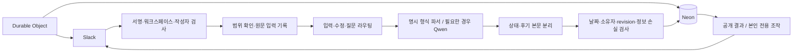
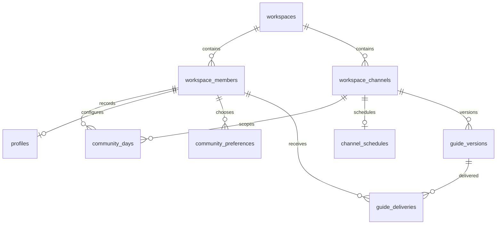

# 시스템 구조

Slack이 입력을 전달하고 Cloudflare Worker가 검증·분류·저장을 맡습니다. Neon PostgreSQL이 기록의 원본이며, Durable Object가 예약과 잔디 갱신 순서를 조정합니다.

## 데이터 원본

| 테이블·뷰 | 책임 |
| --- | --- |
| `workspaces`, `workspace_channels` | 워크스페이스와 채널 식별, 공개 목표 채널 지정 |
| `workspace_members` | 공통 회원 키. 회원 존재 자체가 관리자·초대 권한은 아님 |
| `community_days` | 회원·채널·날짜별 목표·상태·후기의 유일한 원본 |
| `goals` | 공개 목표 채널만 읽는 호환 뷰. 별도 목표 저장소가 아님 |
| `profiles` | 회원별 잔디 색상·시작일 |
| `community_events` | 변경 전 상태·revision·중복 방지·되돌리기 이력 |
| `community_preferences`, `channel_schedules` | 개인 안내와 공통 일정 |
| `community_milestones` | 첫 등록·첫 완료·첫 후기 이력 |
| `community_records` | 재처리 가능한 입력 원문, 확인 대기·발송·가입 안내 등 워크플로 기록 |
| `member_introductions` | 회원별 현재 한 문장 소개·선택적 LinkedIn·기타 공개 정보·공개 메시지 위치·revision |
| `guide_versions`, `guide_deliveries` | 안내 본문 버전과 회원별 전달 |
| `schema_migrations`, `otl_archive` | 적용 이력과 이관 전 데이터 보존 |

## 변경과 해석 경계

서명과 범위를 통과한 입력은 원문·정규화 본문·대상 날짜·Slack 위치를 먼저 워크플로 기록에 보존합니다. 명확한 후기 헤더는 결정적으로 파싱하고, 자유로운 표현에는 Qwen을 사용합니다. 모델은 작성자 권한·저장 날짜·보상·퇴장을 결정하지 않습니다.

모델 해석은 곧바로 DB 동작이 되지 않습니다. 결정 계층이 `수행 상태`, `후기 원문`, `확인 필요 여부`, `현재 날짜에 적용해도 되는지`를 별도 값으로 만듭니다. 상태만 있는 짧은 문장은 상태만 바꿀 수 있지만, 설명·느낌·배움이 포함될 가능성이 있는 본문은 모델이 완료만으로 축소해도 확인 없이 버리지 않습니다. 명시한 과거 날짜는 오늘 기록 확인으로 바꾸지 않습니다.

저장은 현재 revision을 확인하고 중복 요청 키를 사용합니다. Slack 글 편집은 원래 작성자·채널·스레드를 유지하되 편집 timestamp로 요청을 구분합니다. 상태만 있는 완료는 후기 제출로 만들지 않습니다.

## 게시와 예약

공개 잔디에는 결과만 표시하고 개인 조작은 ephemeral로 보냅니다. 잔디는 수정 대상 날짜와 별개로 오늘까지의 이력을 사용합니다. 새 게시 성공 후 관리 중인 옛 이미지·버튼만 제거해 댓글을 보존합니다.

예약은 채널별 Durable Object alarm과 DB의 발송 조건·claim을 함께 사용합니다. 최초 축하도 DB 판정과 목적 채널별 발송 기록을 구분합니다. 부가적인 AI 응원 실패가 먼저 실행된 축하를 막지 않게 합니다.

외부 Slack API와 DB 사이의 완전한 분산 원자성은 보장하지 않습니다. 실패·응답 불확실 상태에는 운영 대조가 필요합니다. DB 계정 최소 권한 분리, 대규모 부하, 자동 백업·복구 SLO는 후속 과제입니다.

## 확장 규칙

새 기능은 공통 회원 키를 참조합니다. 자기소개 원문, 소개자 관계, 외부 연락처 동의를 한 프로필 필드로 합치지 않습니다. 소개자는 별도 권한이 아닌 관계 출처이며 Silo 소속 모델은 추가하지 않습니다. 핵심 관계는 열·키·외래키로 강제하고, JSONB는 스냅샷과 버전 있는 워크플로 payload에 사용합니다. 적용한 migration은 다시 고치지 않고 새 migration을 추가합니다.

자기소개 모달은 본인에게 바인딩합니다. 소개는 줄바꿈 없는 한 문장 180자 이내이며, 선택적 LinkedIn은 `https://*.linkedin.com/in/...` 프로필 주소만 받고 쿼리와 fragment를 제거합니다. 웹사이트·GitHub·포트폴리오 같은 기타 공개 정보는 별도 한 줄 300자 이내로 저장합니다. `member_introductions`의 revision과 준비·확정 상태가 동시 수정을 막습니다. 최초 제출은 설정된 자기소개 채널에 게시하고 이후 수정은 저장된 `message_ts`를 사용해 같은 Slack 메시지를 갱신합니다. 전체 보기에는 확정된 현재 소개만 사용하며 이전 문장은 회원에게 노출하지 않습니다.

구체적인 설정·실행 명령은 [개발 가이드](DEVELOPMENT.md)에서만 관리합니다.
