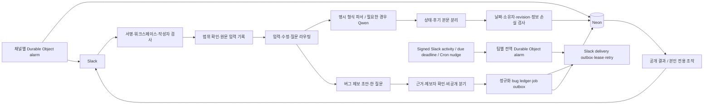
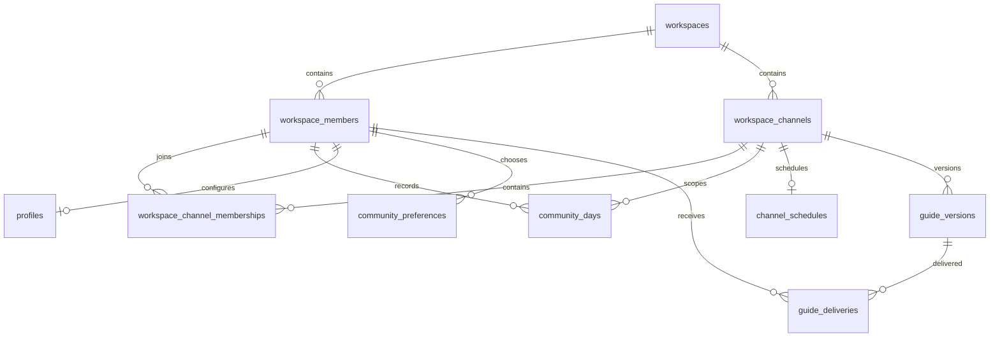
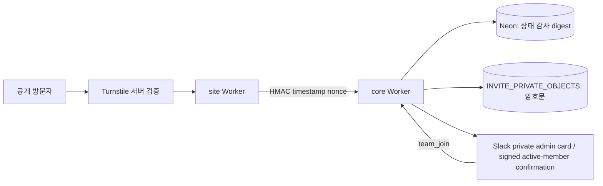

# 시스템 구조

현재 동작의 불변조건과 이벤트별 결과는 [실행 명세](SPEC.md)에 있습니다. 이 문서는 그 동작을 구현하는 DB·Worker·Durable Object 경계를 설명합니다.

Slack이 입력을 전달하고 Cloudflare Worker가 검증·분류·저장을 맡습니다. Neon PostgreSQL이 기록의 원본이며, Durable Object가 예약과 잔디 갱신 순서를 조정합니다.

## 데이터 원본

| 테이블·뷰 | 책임 |
| --- | --- |
| `workspaces`, `workspace_channels` | 워크스페이스와 채널 식별, 공개 목표 채널 지정 |
| `workspace_members` | 공통 회원 키와 Slack 사람·봇·삭제 상태. 회원 존재 자체가 관리자·초대 권한은 아님 |
| `workspace_channel_memberships` | 완전한 Slack 채널 회원 스냅샷에서 확인한 현재 소속과 마지막 관찰 시각 |
| `community_days` | 회원·채널·날짜별 목표·상태·후기의 유일한 원본 |
| `goals` | 공개 목표 채널만 읽는 호환 뷰. 별도 목표 저장소가 아님 |
| `profiles` | 회원별 잔디 색상·시작일 |
| `community_events` | 변경 전 상태·revision·중복 방지·되돌리기 이력 |
| `community_preferences`, `channel_schedules` | 개인 안내와 공통 일정 |
| `community_milestones` | 첫 등록·첫 완료·첫 후기 이력 |
| `community_records` | 재처리 가능한 입력 원문, 확인 대기·발송·가입 안내 등 워크플로 기록 |
| `community_garden_projections` | 회원·날짜·Slack 스레드별 잔디의 desired/published revision과 활성 메시지 영수증 |
| `community_garden_deliveries` | projection route·날짜 revision별 잔디 게시 outbox, lease·payload digest·재시도·Slack 영수증 |
| `member_introductions` | 회원별 현재 자기소개·선택적 LinkedIn·기타 공개 정보·공개 메시지 위치·revision |
| `guide_versions`, `guide_deliveries`, `guide_publishers` | 불변 발행 hash·버전·정제 본문·순서 있는 Slack 이미지 ID, 등록 발행자와 회원·hash별 전달 및 수정본 감사 이력 |
| `bug_reports`, `bug_report_revisions`, `bug_questions` | 제보별 정규화 상태, 제보자만 읽는 revision, 한 질문씩의 답변 이력 |
| `bug_events`, `bug_transition_contract`, `bug_jobs` | 허용 상태 전이, idempotency 이력, 재현·수정·검토·배포 작업 outbox |
| `bug_deliveries` | 질문·요약·접수 영수증·비공개 관리자 인계의 Slack delivery outbox와 lease·재시도·발송 영수증 |
| `bug_artifacts`, `bug_links`, `agent_runs`, `git_changes` | digest로 참조하는 산출물, 중복·회귀 관계, 이후 작업의 관찰 이력 |
| `referral_capacity_defaults`, `referral_capacity_members`, `referral_capacity_events` | 운영자만 바꾸는 전역·회원별 lifetime 초대 한도와 불변 변경 감사. 가입과 승인 예약만 계산함 |
| `interest_requests`, `interest_consents`, `interest_attachment_consents` | 비소속자 비공개 문의의 상태, `interest-consent-v1`과 별도 `invite-consent-v1` |
| `interest_private_payloads`, `interest_submission_receipts` | 문의 원문의 암호화 객체 참조와 멱등 접수 영수증 |
| `interest_introduction_evidence`, `interest_introduction_prompts`, `interest_referral_bridges` | 활성 회원의 서명 확인, 한 번 쓰는 prompt, 확인 뒤 일반 소개 신청 하나에 붙인 관계 |
| `interest_events`, `interest_outbox`, `interest_service_nonces` | team 범위 상태 감사, 비공개 관리자 효과, site-to-core 재사용 거절 |
| `schema_migrations`, `otl_archive` | 적용 이력과 이관 전 데이터 보존 |

## 변경과 해석 경계

서명과 범위를 통과한 입력은 원문·정규화 본문·대상 날짜·Slack 위치를 먼저 워크플로 기록에 보존합니다. 명확한 후기 헤더는 결정적으로 파싱하고, 저장할 때 `후기:`·`회고:` 머리말을 본문에서 제거합니다. 문장 선두의 명시적 날짜만 대상 날짜로 해석하며 본문의 숫자·시간·버전·과거 이유 표현은 내용으로 보존합니다. 자유로운 표현에는 Qwen을 사용합니다. 모델은 작성자 권한·저장 날짜·보상·퇴장을 결정하지 않습니다.

모델 해석은 곧바로 DB 동작이 되지 않습니다. 결정 계층이 `수행 상태`, `후기 원문`, `확인 필요 여부`, `현재 날짜에 적용해도 되는지`를 별도 값으로 만듭니다. 목표가 있는 날짜의 유효한 후기 원문은 수행 상태가 없더라도 먼저 canonical day에 저장하고 상태·잔디를 게시합니다. 상태 질문은 reflection과 분리된 durable record와 delivery attempt로 관리하며, Slack 전송 실패는 후기를 롤백하지 않습니다. 같은 스레드의 자연어 답변과 소유자·날짜·원문 위치·revision에 묶인 버튼만 pending outcome을 닫을 수 있습니다. 상태만 있는 짧은 문장은 상태만 바꿀 수 있지만, 설명·느낌·배움이 포함될 가능성이 있는 본문은 모델이 완료만으로 축소해도 확인 없이 버리지 않습니다. 명시한 과거 날짜는 오늘 기록 확인으로 바꾸지 않습니다.

ONE THING 서비스 날짜는 한국 시간 오전 2시에 바뀝니다. 공통 날짜 함수가 00:00~01:59 timestamp를 전날로 정규화하며 이벤트, 상호작용, 자연어 해석, 잔디 기준일이 같은 값을 사용합니다.

저장은 현재 revision을 확인하고 중복 요청 키를 사용합니다. Slack 글 편집은 원래 작성자·채널·스레드를 유지하되 편집 timestamp로 요청을 구분합니다. 상태만 있는 완료는 후기 제출로 만들지 않습니다.

## 게시와 예약

공개 잔디에는 결과만 표시하고 개인 조작은 ephemeral로 보냅니다. 처음에는 네 칸, 참여 기간이 늘면 여덟 칸으로 확장합니다. 아홉째 날부터는 새 페이지로 초기화하지 않고 오늘을 포함한 최근 평일과 참여한 주말·대한민국 공휴일을 시간순으로 보여줍니다. 미참여 선택일은 숨기며, 오늘 목표는 즉시 연두색으로 나타납니다.

날짜 변경과 같은 트랜잭션에서 revision별 잔디 delivery를 저장합니다. Durable Object는 lease로 이를 claim하고 실패를 최대 세 번 재시도합니다. Slack 응답을 잃으면 팀·채널·회원·날짜·revision·thread·source·payload digest를 모두 포함한 block marker로 해당 스레드만 대조해 중복 게시를 막습니다. 활성 카드는 회원 전체가 아니라 날짜와 스레드로 정한 projection route마다 하나입니다. 새 메시지 영수증을 DB에 저장한 뒤 같은 route의 옛 이미지만 제거하므로, 오늘 변경이 9월 15일이나 다른 스레드의 잔디를 지우지 않습니다. Migration 025의 bounded reconciliation은 canonical `community_days`를 바꾸지 않고 기록된 상호작용 route를 우선 복원하며, 없을 때만 정확한 일일 prompt timestamp를 fallback provenance와 함께 사용합니다.

일반 커뮤니티 예약은 채널별 Durable Object alarm과 DB의 발송 조건·claim을 함께 사용합니다. 공개 수집 시점마다 `conversations.members` 전 페이지와 최대 동시 5개의 `users.info` 조회를 끝낸 완전한 스냅샷만 반영합니다. 채널의 마지막 관찰 시각보다 오래된 out-of-order 스냅샷은 무시하고, 재입장은 현재 소속만 되살리며 기록·개인 시각·opt-out을 보존합니다. 일부 페이지·프로필 조회가 실패하면 소속을 바꾸거나 누구도 멘션하지 않습니다. 공통 10시·18시 수집은 현재 사람 회원을 공개 글 하나로 묶고, 개인 기본 11시·20시 대상도 저장 시각과 당일 상태로 due인 회원을 공개 채널 일괄 글로 보냅니다. DM이나 한 사람별 fanout은 없습니다. 한 글은 100명과 Slack 본문 한도로 제한해 결정적 순서로 나누고, 각 delivery는 lease와 최대 세 번 시도를 사용합니다. 재시도 전에는 정확한 본문을 최대 10페이지 history에서 찾아 이미 수락된 글이면 기존 시각을 영수증으로 채택하며, 아직 due인 회원만 남깁니다. 비공개 관리 채널의 관리자 전용 수집 테스트도 저장된 공개 채널 시각과 같은 경로를 호출하고, 발급 메시지·당일·소유자에 묶인 일회성 record를 먼저 claim합니다. 버그 delivery와 24시간 만료는 팀별 전역 Durable Object alarm이 자기 팀으로 범위를 고정해 정확한 due·activity 시각을 잡습니다. reconciliation·만료·claim 중 한 단계라도 10건 batch를 채우면 backlog가 남을 수 있으므로 5분 alarm을 유지하고, 모두 batch 미만으로 내려간 뒤에만 한 시간 안전 검사로 돌아갑니다. Cron은 이 alarm을 다시 거는 backup/nudge이며 delivery SQL을 실행하지 않습니다. 최초 축하도 DB 판정과 목적 채널별 발송 기록을 구분합니다. 부가적인 AI 응원 실패가 먼저 실행된 축하를 막지 않게 합니다.

Share Info·Chapter 반응은 Events API와 15분 bounded history reconciliation이 같은 결정적 처리기를 사용합니다. Events API에는 `event.channel`이 있지만 `conversations.history`의 각 message에는 채널이 없으므로, reconciliation 경계가 순회 중인 채널 ID를 붙여 canonical event로 만든 뒤 검증합니다. 처리기는 효과보다 먼저 `share-info:<message_ts>` DB 영수증을 claim하며, 이벤트와 재수집이 겹쳐도 같은 글을 한 번만 처리합니다. 이 경계를 검증하는 fixture는 Slack history 원형과 같게 message의 channel을 제공하지 않습니다.

welcome 가이드는 일반 DB 연결과 분리합니다. Worker의 `otl_guide_runtime` 역할은 최신 발행본 조회·가입 전달 claim/finish만, 발행 CLI의 `otl_guide_admin` 역할은 발행·명시적 대상 복구만 실행합니다. 발행본은 채널 Canvas와 핀 메시지에 반영하고, 신규 회원별 delivery는 전문 복사 대신 Canvas 링크만 보냅니다. 두 역할은 테이블 직접 권한이 없고, DB 소유자 연결은 migration과 역할 부트스트랩에만 사용합니다. 외부 Slack API와 DB 사이의 완전한 분산 원자성은 보장하지 않습니다. 실패·응답 불확실 상태에는 운영 대조가 필요합니다. 대규모 부하와 자동 백업·복구 SLO는 후속 과제입니다.

## 버그 제보 경계 v0.0.54 구현 상태

피드백은 하나의 짧은 모달에서 시작하고 feedback 채널의 제보자 멘션 글과 그 스레드에 정규화합니다. 최초 입력 위치는 링크로만 보존하고, 질문·분류·관리자 승인은 canonical feedback thread에서 진행합니다. 동일한 제출 재시도는 결정적인 버그 키와 최근 Slack history를 대조해 기존 스레드를 재사용합니다. 기존 암호화 ledger와 durable 질문 delivery를 재사용하되 사용자에게 버그 분류를 요구하지 않습니다. 문서 계약·관찰 결과·원하는 변화·트리거·검증 가능한 수용 조건을 기준으로 한 번에 하나만 물으며 세 번 뒤에는 불완전성을 표시한 관리자 검토 카드로 전환합니다.

원문과 답변은 revision·schema·키 버전을 추가 인증 데이터로 묶은 AES-GCM 비공개 객체에 둡니다. 최초 incoming record는 `bug_intake` 표식과 SHA-256 digest만 저장하며 raw·normalized text를 저장하지 않습니다. 정규화 PostgreSQL에는 opaque reference, 암호문 digest, wrapped data key, nonce와 제한된 비민감 필드만 두고, migration 022의 소유자 범위 read가 후속 역질문에 필요한 암호화 객체 복원 정보만 반환합니다. `privacy` 또는 보안·개인정보 영향은 `private_incident`로 전이하면서 관계형 필드의 원문을 지우고 공개 export를 막아 비공개 운영자 채널로만 인계합니다. 제보자 소유권, revision, idempotency, 확인 시각, canonical packet·evidence digest가 모두 맞을 때만 `bug_packet.v1` 확정 패킷을 저장합니다. 암호화 객체 저장소와 키 설정이 없으면 제보를 부분 저장하지 않고 실패합니다. 새 비공개 초안·답변은 상태 전환, 관계형 원문 제거, receipt·관리자 handoff를 같은 트랜잭션에 묶고, 과거 중간 상태는 팀 범위의 idempotent reconciliation으로 한 번만 복구합니다. migration 021의 순차 upgrade backfill은 암호화 객체의 opaque reference·digest와 append-only event를 보존하면서 기존 관계형 원문을 scrub하고 누락된 private receipt·관리자 handoff만 보정하며, 신규 설치에서는 0건이어야 합니다.

`bug_jobs`는 제공자와 분리된 재현·수정·검토·배포 작업 outbox입니다. `bug_deliveries`는 Slack에 질문·요약·접수 영수증·비공개 관리자 인계를 보내기 전의 durable record입니다. delivery key, 제보자 소유권, packet revision, template과 renderer가 같은 경우에만 idempotent하게 다시 읽고, worker lease를 가진 발송만 완료할 수 있습니다. 실패는 다음 시도 시각과 오류 분류를 남겨 독립적으로 재시도하며 세 번째 실패 뒤에는 retry 없이 `failed` dead-letter로 남깁니다. 만료와 delivery claim 함수는 team ID를 필수로 받아 다른 워크스페이스의 due 행을 건드리지 않습니다.

관리자 승인 경계에서만 Slack Codex 앱에 작업 패킷을 전달합니다. 패킷은 `docs/SPEC.md`, `USER_GUIDE.md`, `PRODUCT_PRINCIPLES.md`, `ARCHITECTURE.md`, `OPERATIONS.md`를 원본으로 지정하고 `feedback/<id>` 격리 브랜치, 전체 검증, draft PR, 자동 머지 금지를 요구합니다. Workspace admin/owner 판정은 Slack `users.info` 응답으로 다시 확인합니다. GitHub Actions는 사용하지 않습니다.

## 확장 규칙

새 기능은 공통 회원 키를 참조합니다. 자기소개 원문, 소개자 관계, 외부 연락처 동의를 한 프로필 필드로 합치지 않습니다. 소개자는 별도 권한이 아닌 관계 출처입니다. 핵심 관계는 열·키·외래키로 강제하고, JSONB는 스냅샷과 버전 있는 워크플로 payload에 사용합니다. 적용한 migration은 다시 고치지 않고 새 migration을 추가합니다.

자기소개 모달은 본인에게 바인딩합니다. 소개는 줄바꿈을 포함해 180자 이내이며, 선택적 LinkedIn은 `https://*.linkedin.com/in/...` 프로필 주소만 받고 쿼리와 fragment를 제거합니다. 웹사이트·GitHub·포트폴리오 같은 기타 공개 정보는 별도 한 줄 300자 이내로 저장합니다. `member_introductions`의 revision과 준비·확정 상태가 동시 수정을 막습니다. 최초 제출은 설정된 자기소개 채널에 게시하고 이후 수정은 저장된 `message_ts`를 사용해 같은 Slack 메시지를 갱신합니다. 확정된 현재 revision 전체를 채널 Canvas에 투영하며, 등록·수정과 전체 보기에서 같은 동기화 함수를 사용합니다. 이전 문장은 회원에게 노출하지 않습니다.

구체적인 설정·실행 명령은 [개발 가이드](DEVELOPMENT.md)에서만 관리합니다.

## 계획된 membership·site 경계

다음 구조는 v0.0.56–v0.0.70의 미출시 경계입니다. core Worker는 Slack 서명, lifecycle·초대 한도·소개 신청·비소속자 문의 저장, R2 비공개 객체와 Slack 효과를 맡고, 공개 site Worker는 서비스 바인딩 `CORE`로만 core에 요청합니다. site Worker에는 Slack·Neon 자격증명을 두지 않습니다. 현재 core shadow와 migration 036·037은 staged implementation일 뿐 출시가 아닙니다.

기존 수동 검토 소개 신청과 비소속자 문의의 본문·이메일·철회 capability는 R2의 전용 `INVITE_PRIVATE_OBJECTS`에 versioned AEAD 암호문으로 둡니다. `shared_invite` 직접 예약은 원문 이메일이나 R2 객체 없이 equality digest와 동의만 관계형 DB에 둡니다. 관계형 DB에는 opaque reference, digest, 동의·상태·revision·최소 감사 값만 남깁니다. `SITE_CORE_HMAC_SECRET`은 site와 core의 요청 인증에, `INVITE_EMAIL_PEPPER`는 정규화 이메일 equality digest에, `INVITE_PRIVATE_KEK`과 `INVITE_PRIVATE_KEK_VERSION`은 신청 비공개 객체에만 사용합니다. 이 값은 공개 구성·브라우저·로그·export에 넣지 않습니다.

referral·lifecycle·interest의 DB 함수와 비공개 객체 참조는 항상 workspace/team 범위에서 조회·변경합니다. site 서명은 site-to-core 요청을 인증할 뿐 다른 workspace의 신청·lifecycle·admin 카드에 대한 권한을 만들지 않습니다. runtime scheduler도 같은 DB/store 범위 안에서 만료·정리만 실행합니다.

lifecycle 정정은 일반 Worker `DATABASE_URL`에서 분리한 `LIFECYCLE_ADMIN_DATABASE_URL`로만 실행합니다. 035의 `otl_lifecycle_admin_login`은 Neon 호환 제한 로그인 역할이며, 직접 테이블 접근과 일반 lifecycle runtime·소개·guide 함수는 받지 않습니다. 후보 범위 읽기와 audit가 남는 `restore_error`만 허용합니다. 이 연결을 쓰는 Slack 입력은 서명 검증 뒤 설정된 workspace, 지정 관리자, 공개 채널과 다른 비공개 admin 채널을 모두 확인하므로 site 서명이나 scheduler가 lifecycle 관리자 권한을 얻을 수 없습니다.

사이트의 Turnstile 검증은 서버에서 hostname·action·single-use token을 확인한 뒤에만 core에 전달합니다. nonce와 timestamp는 재사용을 거절하고 사용 후 정리합니다. 기존 `manual_review` 신청은 운영자 결정과 수동 초대 표식을 유지합니다. 새 `shared_invite` 경로는 이름·자기소개·R2 payload 없이 이메일 digest와 동의만 저장하고 `approved` 예약을 원자적으로 만듭니다. Site Worker는 Core의 수락 응답 뒤에만 `SLACK_SHARED_INVITE_URL` secret의 canonical `join.slack.com` URL로 303을 반환하며, 이 URL은 정적 HTML·구성·로그·공개 export에 포함하지 않습니다. 공식 공유 초대로 가입한 뒤 Slack 계정 이메일과 예약 digest가 정확히 일치한 `team_join`만 소개 출처로 기록하며, 그때 기존 자기소개 버튼을 DM으로 한 번 안내합니다.

036의 `referral_capacity_status`는 전역 기본값 또는 회원별 override에서 lifetime 최대를 정하고, joined attribution과 `approved` 예약을 더합니다. 기본값은 2이며 pending 소개 신청과 `pending_introduction` 관심 문의는 수에 넣지 않습니다. `otl_referral_admin_login`만 `referral_capacity_admin_execute`를 호출하며, 일반 runtime과 회원은 한도를 수정하거나 승인할 수 없습니다. `REFERRAL_ADMIN_DATABASE_URL`은 이 역할의 별도 연결이고 공개 export에는 빈 placeholder만 둡니다.

037의 `/interest`는 일반 소개 링크가 없는 사람의 운영자 전용 문의를 받습니다. 이 문의는 referral·quota·Slack invite를 만들지 않습니다. 문의자는 `interest-consent-v1`과 `invite-consent-v1`을 각각 수락하고, 이름·이메일 공유는 별도로 선택합니다. 공유를 거부하면 admin 카드에 회원 선택 action을 만들지 않고, 임의의 offline digest나 운영자 주입 행으로도 attach할 수 없습니다. 운영자가 지목한 활성 회원은 별도 비공개 Slack prompt에서 서명 확인을 남겨야 `introduction_verified`가 됩니다. 그 다음에만 ordinary pending referral 하나를 붙일 수 있고, `approved`가 되기 전에는 초대 한도를 예약하지 않습니다.

interest runtime은 `INTEREST_RUNTIME_DATABASE_URL`로 만료·정리만 하고, `INTEREST_ADMIN_DATABASE_URL`은 비공개 admin 카드, `INTEREST_MEMBER_DATABASE_URL`은 활성 회원의 서명 확인에만 씁니다. `INTEREST_ADMIN_CHANNEL_ID`는 공개 채널과 달라야 하며, `PUBLIC_INTEREST_ENABLED`를 비롯한 모든 membership flag는 기본 꺼짐입니다. 이 role URL, `REFERRAL_ADMIN_DATABASE_URL`, HMAC·키·R2 이름·신청 데이터는 공개 config와 export에 넣지 않습니다.

활성 플래그는 모두 기본 꺼짐이며 서로 독립적입니다. `LIFECYCLE_MODE=disabled|shadow|enforce`, `REVIEW_THREAD_V2`, `GARDEN_RECONCILIATION`, `REFERRALS_ENABLED`, `PUBLIC_APPLICATIONS_ENABLED`, `PUBLIC_INTEREST_ENABLED` 중 하나가 없거나 잘못되면 해당 새 경로는 닫힙니다. migration 029–042는 028 뒤에 추가로만 적용합니다. `034_referral_runtime_retention.sql`은 runtime scheduler가 30일 소개 신청 만료·정리와 12개월 비식별 decision/security audit 보존만 처리하게 하며, runtime role에는 approve·reject·mark-invited 권한을 주지 않습니다. 035의 전용 lifecycle 관리자 로그인과 036의 referral admin login, 037의 active-member confirmation login은 서로 권한을 확장하지 않습니다.
