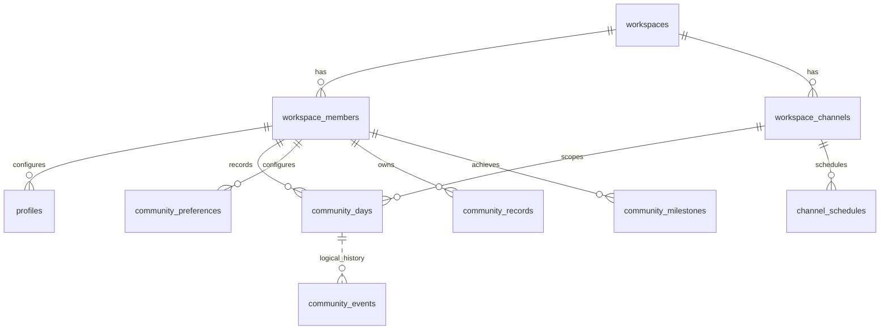

# PostgreSQL 설치 및 구조

## 신규 설치

빈 PostgreSQL 17 DB에서 아래 명령을 실행하세요. PGHOST, PGPORT, PGUSER, PGDATABASE와 인증은 로컬 환경에서 지정합니다. 명령문에 운영 비밀번호를 넣지 마세요.

```sh
psql -X -v ON_ERROR_STOP=1 -f migrations/001_initial.sql -f migrations/005_community.sql
psql -X --single-transaction -v ON_ERROR_STOP=1 -f migrations/006_normalized_foundation.sql -f migrations/007_normalized_legacy.sql
psql -X -v ON_ERROR_STOP=1 -f migrations/008_default_reminders.sql
```

006과007은 반드시 한 트랜잭션에서 적용합니다.002–004의 별도 초대·가입 정책은 이 설치에 포함하지 않습니다. 공개006은 신규 설치용이며 특정 운영 회원이나 사전 승인된 예외를 포함하지 않습니다.

새 워크스페이스의 첫 공개 기록이 생성된 뒤, 레거시 /one 및 잔디 조회를 사용하려면 workspaces.primary_goal_channel_id를 명시적으로 설정해야 합니다. workspace_channels에 해당 채널이 존재하는지 확인하고 관리자가 지정한 공개 채널만 연결하세요. 비공개 테스트 채널로 추측해 연결하지 마세요.

기존 데이터 이관은 먼저 별도 백업과 복원 시험, 쓰기 중단, 명시적 워크스페이스/채널 매핑, 충돌 대조를 수행해야 합니다.006 내 매핑 위치에 본인 검토값을 작성하세요. 원본과 레거시 기록이 다르면 공개 이관은 중단됩니다. 실제 자료를 확인한 사람이 판단·근거·복구 방법을 비공개 문서로 승인한 뒤 재시도하세요. 충돌 검사를 제거해서 통과시키지 마세요.

## 관계



회원의 키는 (team_id,user_id), 채널은 (team_id,channel_id), 날짜별 기록은 (team_id,channel_id,user_id,day)입니다. community_days가 목표·후기의 원본이며 goals는 지정된 공개 채널을 읽는 호환 뷰입니다. 이벤트와 날짜의 연결은 논리 관계이며 ERD 점선은 DB 외래 키를 의미하지 않습니다. 과거 데이터는 otl_archive에 보존되며 공개 저장소에는 DB 내용이 없습니다.

## 로컬 테스트

운영 Neon을 사용하지 않는 폐기 가능한 로컬 PostgreSQL을 준비하고 위 신규 설치를 적용합니다. 저장소·스케줄 테스트는 COMMUNITY_PG_SOCKET, COMMUNITY_PG_PORT, COMMUNITY_PG_DATABASE로 해당 DB만 지정합니다.

```sh
bun qa/community-storage.mjs
bun qa/community-scheduler.mjs
node qa/normalized-legacy.mjs
```

기본 소켓 /tmp/otl-community-pg, 포트55439를 사용합니다. DB 이름은 테스트마다 다를 수 있으므로 COMMUNITY_PG_DATABASE를 명시하세요. 실제 운영 백업을 공개 테스트 fixture로 사용하지 마세요.

## 환영 가이드·첫 등록

008까지 적용 후009_welcome_guides.sql과010_first_registration.sql을 순서대로 적용합니다. COMMUNITY_WELCOME_CHANNEL_ID와 COMMUNITY_GUIDE_SOURCE_TS는 관리자가 작성한 원본 채널·메시지로 설정하세요.
