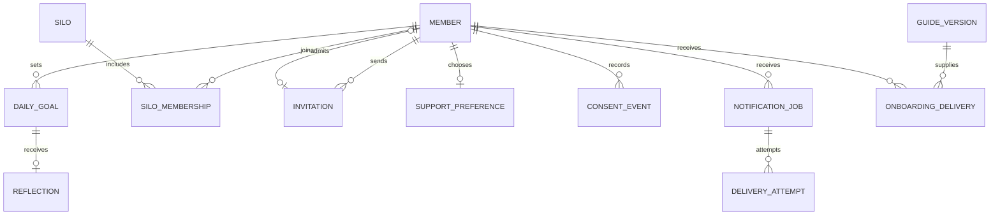

# 먼저 챙기고, 다시 시작할 기회를 주는 OT1L

작성·자료 확인: 2026-09-10. 상태: **조사에 근거한 운영·데이터 설계 제안. 구현 및 운영 정책 확정 전.**

## 1. 서비스가 이루려는 일

사용자 방향: “결국 우리 목표는 사람들이 잘 이룰 수 있도록 먼저 챙겨주고 기회주고 하는 거야.”

봇은 중요한 일을 정하고, 실제로 실행하고, 막힌 이유를 돌아보고, 다시 시도하도록 돕는다. 후기 제출률과 연속 접속은 보조 지표다. 실제로 중요한 일을 해냈는지, 어려울 때 돌아올 수 있었는지를 함께 확인한다.

확정된 사용자 요구는 채널 안에서 쉬운 목표·후기 작성, 공개 잔디, Silo 관계와 경쟁, 최신 가이드와 신규 참여자 적응 지원, 동의 기반 카카오 알림이다. 추가 확정: ‘오늘 쉬기’를 선택하면 사유 없이 그날 참여를 마무리하고 추가 알림을 멈춘다. 아래 시간·횟수·점수 규칙은 아직 제안이다.

## 2. 실제 커뮤니티에서 출발하기

[welcome 가이드](https://onething1line.slack.com/archives/C0C013CF223/p1788918081920379)는 10시 원씽, 18시 후기를 안내한다. Silo는 초대 기반 학교·직장·모임이고 Chapter는 직군·관심사다. 가이드의 현재 2명 초대와 이전 대화의 월 1장 초대권은 적용 관계가 미정이다.

[9월 8일](https://onething1line.slack.com/archives/C0BVB9HSL10/p1788858026573839), [9월 9일](https://onething1line.slack.com/archives/C0BVB9HSL10/p1788944425539809), [9월 10일](https://onething1line.slack.com/archives/C0BVB9HSL10/p1789030802998809) 후기 스레드에는 완료뿐 아니라 50%, 5/10의 부분 수행과 사유도 있다. 다음 날 후기와 운영자의 수동 요청도 관찰했다. 이 관찰만으로 미제출 이유나 알림 효과를 추론하지 않는다.

- 18시는 확인된 공통 알림 시각이다. 지각 판정을 위한 최종 마감으로 확정하지 않는다.
- 목표 완료와 후기 제출을 별도로 기록한다. 미완료 사유를 쓴 사람에게 후기 독촉을 계속하지 않는다.
- 일반 답글과 `thread_broadcast` 모두 처리한다. 다른 사람을 태그한 후기 요청은 제출로 세지 않는다.
- 기존 10시·18시 공통 알림을 재사용하고 동일 알림을 추가로 만들지 않는다.

## 3. 듀오링고에서 배울 것과 한계

아래는 공식 제품·엔지니어링 글의 설계 사례다. 게시 당시 기능과 자체 보고이며, 현재 모든 계정의 동일한 동작이나 OT1L의 효과를 보장하지 않는다. 제품을 직접 사용한 비교 실험은 수행하지 않았다.

| 확인한 사례 | OT1L에 적용할 제안 | 주의할 점 |
| --- | --- | --- |
| 높은 일일 목표와 연속 기록을 분리하고, 한 레슨으로 연속 기록을 이어가게 변경했다. 자체 실험에서 재방문은 늘었지만 일일 목표 달성자는 줄었다. [출처](https://blog.duolingo.com/improving-the-streak/) | 큰 목표의 성취와 작은 참여·회고를 따로 인정한다. | 후기만 써도 목표 완료로 바꾸면 성취 지표가 왜곡된다. |
| Streak Freeze로 놓친 날에 유연성을 제공한다. [출처](https://blog.duolingo.com/how-duolingo-streak-builds-habit/) | 하루 놓쳐도 누적 성취를 보존하고 다시 시작할 길을 제공한다. | 휴식을 실제 수행으로 기록하거나 과거 잔디를 초록색으로 바꾸지 않는다. |
| Friend Streak는 상대방의 수락을 거쳐 함께 유지하고 친구가 알림을 보낼 수 있다. [출처](https://blog.duolingo.com/friend-streak/) | 같은 Silo 안에서 선택적으로 응원 짝을 맺는다. | 초대자가 자동으로 반복 독촉할 권한을 얻는 구조로 만들지 않는다. |
| 사전 작성한 알림 문구를 상황에 맞춰 선택하고 실험했다. 2020년 공개 방식은 밴딧 알고리즘이다. [출처](https://blog.duolingo.com/hi-its-duo-the-ai-behind-the-meme/) | 우선 소수의 정중한 문구와 사용자가 정한 시각으로 시작한다. | LLM 도입 자체가 개인화의 성과는 아니다. 알림 반응과 목표 달성은 다르다. |
| 서비스 장애로 연속 기록이 손상되지 않도록 보호하는 설계를 공개했다. [출처](https://blog.duolingo.com/protecting-streaks-from-site-issues/) | 수집 장애가 의심되면 미제출 판정과 외부 알림을 보류한다. | 시스템의 누락을 참여자의 실패로 처리하지 않는다. |

**사용자 결정: 다양한 자연어를 이해하기 위해 LLM을 도입하며 비용 효율을 우선한다.** 문장·오늘 목표·스레드 문맥을 해석하고, 권한·저장·알림은 코드가 처리한다. 애매하면 ‘오늘 원씽을 완료하셨나요?’와 선택 버튼으로 확인한다. 모델 후보·요금·평가 기준은 [LLM 비용안](LLM_COST_PLAN.md)을 따른다. 현재 연결·배포 완료를 뜻하지 않는다.

## 4. 하루 지원 흐름 제안

목표와 후기는 `ot1l-daily-scrum`에서 작성한다. 알림은 그날 스레드로 바로 연결한다. DM은 선택적 개인 지원과 온보딩에 사용하며 입력을 DM으로 강제하지 않는다.

| 순간 | 봇이 할 일 | 참여자가 할 수 있는 일 |
| --- | --- | --- |
| 10시 공통 목표 안내 | 기존 알림을 유지하고 오늘 중요한 한 가지와 이유를 받는다. | 채널에 작성하고 저장 확인을 받는다. |
| 사용자가 정한 실천 전 시각, 후속 단계 | 신청한 사람에게만 시작 기회를 준다. | 바로 시작, 시간 바꾸기, 목표 작게 조정하기. 첫 MVP에서는 생략한다. |
| 18시 공통 회고 안내 | 기존 스레드에서 실제 결과와 느낀 점 또는 미완료 사유를 받는다. | 완료·부분 수행·못함을 솔직히 기록한다. |
| 선택한 저녁 확인 시각 | 참여 대상이고 후기가 없는 사람에게만 개인 알림을 보낸다. | 후기 쓰기 / 나중에 알려줘 / 오늘 쉬기 / 도움 요청. |
| 후기 저장 직후 | 저장 성공 표시와 결과를 보여주고 대기 알림을 취소한다. | 기록 확인·수정. 완료 여부는 별도 확인한다. |
| 놓친 뒤 다음 참여일 | 오늘의 작은 시작을 제안한다. | 새 목표를 쓰거나 전날 후기를 뒤늦게 남긴다. 과거 후기 전부를 복귀 조건으로 요구하지 않는다. |

첫 파일럿 기본값 후보: 개인 알림은 선택한 한 채널에서 하루 1회. 사용자가 직접 ‘나중에’를 요청했을 때만 1회 추가, 개인 자동 지원 전체를 합해 하루 최대 2회. 초기 조용한 시간 후보는 22:00~09:00 KST이며 사용자 시간대·설정에 맞춘다. 미응답만으로 반복 발송하지 않는다. 이 숫자는 실험 시작용 제안이지 검증된 최적값이 아니다.

`후기 쓰기`는 입력 화면 또는 해당 스레드를 연다. `완료` 버튼만 누르는 것은 후기 작성과 다르다. **사용자 확정: `오늘 쉬기`는 사유 입력 없이 그날 참여를 마무리하고 추가 알림을 중단한다.** 목표 완료나 후기 제출로 자동 처리하지 않고 휴식으로 구분한다. Silo 점수·분모 반영은 별도 미정이다.

### 메시지 예시

- 확인: “오늘 원씽은 어디까지 해보셨나요? 다 못했어도 괜찮아요. 진행한 만큼과 막힌 이유를 한 줄 남겨주세요.”
- 저장: “후기가 저장됐어요. 목표는 부분 진행으로 기록했어요.”
- 다시 알림: “요청하신 시간이에요. 오늘 있었던 일을 한 줄로 남길 수 있어요.”
- 복귀: “다시 오셨네요. 오늘 할 수 있는 가장 작은 한 가지부터 정해볼까요?”
- 도움: “어디에서 막혔나요? 목표를 줄이거나, 원하면 운영자에게 도움을 요청할 수 있어요.”

도움 요청을 운영자·동료에게 전달하기 전 대상과 내용을 보여주고 사용자가 전송한다. 휴식 사유와 개인 상담 내용은 공개 경쟁판에 노출하지 않는다.

## 5. 잔디와 Silo 경쟁

기존 잔디 의미를 유지한다. 등록은 연두, 완료는 초록, 미등록은 회색이며 개인 팔레트를 사용할 수 있다. 날짜별 고정 칸을 4칸에서 8칸으로 확장하고 후기를 썼다는 이유로 날짜 순서를 옮기지 않는다.

후기·휴식 여부는 색과 별개 텍스트 또는 보조 표시로 구분한다. 색만으로 상태를 전달하지 않는다. 누적 완료일은 하루 빠졌다고 삭제하지 않는다. 4칸을 모두 지나온 것과 4일 모두 완료한 것을 다른 문구로 축하한다.

Silo는 먼저 실제 구성원과 가입·이동 날짜를 매핑한다. 초대 관계, Silo 소속, Chapter 소속은 서로 다른 관계다. 과거 집계를 현재 소속으로 소급해서 이동시키지 않는다.

경쟁안은 주간 단위로 다음 두 값을 나란히 보여주는 것이다.

- **목표 완료율:** 완료한 참여일 / 집계 대상 참여일.
- **회고 참여율:** 후기를 남긴 참여일 / 집계 대상 참여일.

참여일은 가입 이후 활동 대상으로 정한 날짜다. 휴식일·주말 포함 여부는 미정이다. 분모와 구성원 수를 함께 보여주고 소규모 Silo의 비율 변동을 숨기지 않는다. 후기 횟수, 초대 수, 쉬운 목표 반복으로 점수를 무한히 얻지 않도록 하루 한 번만 집계한다. 목표 난이도가 달라 이 비율을 사람의 능력 순위로 해석하지 않는다.

첫 단계는 자기 Silo의 지난주 대비 변화와 공동 달성부터 보여주고, 운영 규칙을 정한 뒤 Silo 간 순위를 추가하는 제안이다. 응원은 가능하게 하되 미제출자 공개 명단과 공동 벌점은 초기 범위에서 제외한다.

## 6. 온보딩과 가이드 갱신

신규 입장 → 현재 발행된 가이드 버전 확인 → welcome 채널에 환영과 최신 가이드 안내 → DM으로 첫 원씽 위치·Silo·지원 설정 안내 → 첫 기록 확인 순서다. 사용자가 요청한 가이드 재게시는 최신 발행본을 사용하며, 여러 사람이 동시에 들어오면 묶어서 올리는 안을 검토한다.

운영자 수정본은 초안과 발행본을 구분한다. 신입에게 어느 버전을 전달했는지 저장하고 ‘발송됨’과 ‘읽음’을 구별한다. 기존 회원에게는 모든 수정마다 전체 가이드를 반복하기보다 변경 요약을 제공하는 안이다.

첫 참여일에 시작을 못했을 때 한 번, 첫 주가 끝날 때 한 번 적응 확인을 제안한다. 일반 후기 알림과 겹치면 합치거나 하나를 생략한다. 자동 응답이 없는 사람에게 횟수를 늘리는 방식으로 전환하지 않는다.

## 7. 카카오톡 연결 경로

후속 사용자 결정: 카카오는 후기뿐 아니라 원씽 미등록 등 확정된 필수 행동의 누락도 안내한다. 행동별 대상·완료·중단 조건과 공통 알림 한도는 [운영 로드맵](SERVICE_ROADMAP.md), 원자적 구현 범위는 [버전 목록](UPDATE_HISTORY.md)에 기록한다. 아래 후기 예시는 전체 카카오 기능 범위를 제한하지 않는다.

일반 Kakao Developers 메시지 API는 사용자 간 상호작용용이다. 커뮤니티 서비스의 자동 알림 수단으로 그대로 사용하지 않는다. [카카오 공식 문서](https://developers.kakao.com/docs/ko/kakaotalk-message/common)

알림톡은 별도의 비즈메시지 경로를 검토한다. 발송 사업자의 문서는 정보성 메시지와 사전 승인 템플릿을 안내한다. **우리 후기 알림이 승인 가능한지는 아직 확인하지 못했다.** 동의를 받는 것만으로 심사가 해결되지는 않는다. [인포뱅크 알림톡 문서](https://infobank-guide.gitbook.io/bizgo/service/channel/kakaobiz/notice)

준비 순서: 사용 시나리오와 문구 작성 → 사업자·발신 프로필·템플릿 자격 확인 → 공급자 선정과 비용 확인 → 연락처 확인 및 목적·채널별 동의·철회 설계 → 승인된 템플릿으로 운영자 테스트 → 소수 신청자 파일럿. 전화번호 기반 알림톡 설계와 카카오 로그인 연동을 동일한 필수 절차로 묶지 않는다.

카카오와 SMS는 각각 선택한다. 카카오 실패만으로 SMS에 자동 전환하지 않는다. 전화번호는 공개 Slack 글로 수집하지 않으며 연락처 저장 접근을 제한하고 보관·삭제 정책을 정한다. 가입이나 Silo 점수를 외부 알림 동의와 연결하지 않는다. 잠금 화면에는 목표·실패 사유 대신 일반적인 안내와 링크만 보여주는 기본안을 권한다.

## 8. 개념 DB: 구현 전 관계 초안

기존 profiles/goals를 확장하는 관계도다. 아래 이름은 새 테이블 생성 명령이 아니며, 모든 후속 기능을 한 번에 만들지 않는다.

| 데이터 | 필요한 구분·제약 |
| --- | --- |
| 회원·소속 | 모든 키에 workspace 경계. Silo 소속 유효 시작/종료일. 한 시점 단일 Silo 여부는 미정. Chapter는 별도 다대다 관계로 후속 확장. |
| 날짜별 목표 | 회원·현지 날짜당 하나. 내용·완료 상태·변경 이력. 원문 메시지 식별자. |
| 후기 | 대상 날짜 `for_date`와 실제 `submitted_at` 분리. 결과·회고 원문·채널/스레드/메시지 식별자. 목표 없는 후기는 임시 보관 후 연결하며 제출 기록을 버리지 않는다. |
| 지원 설정 | 시간대·선호 시각·채널·조용한 시간·일시 중지·휴식일. 동의 기록과 분리. |
| 동의 이력 | 목적·채널·문안 버전·동의/철회 시각. 발송 시 유효 동의를 재확인. |
| 알림 작업 | 회원·대상일·지원 종류·단계에 대한 중복 방지 키, 예약 시각, 취소/처리 상태. 채널을 바꿔도 같은 요청 중복 금지. |
| 전달 시도 | 공급자 요청 ID와 접수/전달/실패/불명 상태. 공급자 접수가 실제 수신이나 읽음을 뜻하지 않는다. |
| 가이드 전달 | 발행 버전과 수신자별 발송 기록·명시적 확인 시각. 입장 이벤트 재수신 중복 방지. |

발송 직전 최신 후기·활동 상태·동의·일일 한도를 확인하고 DB에서 작업을 독점 점유한다. 저장과 발송 사이 경합은 외부 API까지 완전한 단일 트랜잭션으로 묶을 수 없으므로, 전송 직전 재확인과 공급자 중복 방지 기능을 사용한다. 응답이 불명확한 요청은 무조건 재전송하지 않는다. 공급자 기능에 따른 잔여 중복 가능성은 구현 때 검증한다.

## 9. 작게 시작하는 우선순위

| 순서 | 범위 | 사용자 관점 완료 조건 |
| --- | --- | --- |
| 1 | 후기 저장·수정·확인과 목표 상태 분리 | 채널 답글과 방송 답글 모두 저장된다. 부분 수행 후기도 확인을 받고 알림 대상에서 빠진다. |
| 2 | 신청자 대상 Slack 지원 1회, 미루기·중지 | 정한 시간에 필요한 사람만 안내받고 제출·철회 후에는 멈춘다. |
| 병행 준비 | Silo 구성원 매핑, 카카오 자격·템플릿 확인 | 매핑을 운영자가 확인하고 카카오 발송 가능 여부를 실제 심사 경로로 판단한다. |
| 3 | 동의 기반 카카오 파일럿 | 테스트 수신 확인, 철회·오발송 방지, 별도 SMS 선택 검증. |
| 4 | 최신 가이드 전달과 첫 주 적응 지원 | 신입이 현재 가이드를 받고 채널에 첫 목표를 남긴다. |
| 5 | Silo 공동 진척과 주간 경쟁 | 실제 소속·활동일 분모가 맞고 이동·휴식으로 집계가 왜곡되지 않는다. |

첫 검증은 admin-dev의 운영자 계정으로 수행한다. 실제 회원 발송 전 후기 직전/직후 예약, 중복 이벤트, 철회, 조용한 시간, 휴식, 가입 전 날짜, 공급자 응답 불명, 수집 장애를 확인한다. 이는 앞으로 할 검증 목록이며 현재 통과했다는 뜻이 아니다.

그다음 신청한 소수 회원에게 2주 파일럿을 제안한다. 기록할 값은 실제 목표 완료율, 부분 수행 후 다음 참여일 복귀, 후기 제출률, 잘못된 알림 건수, 수신 중지, 운영자 수동 개입이다. 분모와 표본 수를 함께 기록하고 알림이 도움이 됐는지 짧게 묻는다. 작은 전후 비교는 인과 효과의 증명이 아니다. 오발송·철회 후 발송이 확인되면 해당 자동 발송을 중지하고 원인을 확인한다.

## 10. 다음 인터뷰 결정

**휴식 선택의 의미는 확정됐다.** 사용자가 ‘마무리하게하자’고 답했다. 사유를 요구하지 않고 그날 참여를 마무리하며 추가 알림을 중단한다. 휴식의 경쟁 집계 방식은 아직 정하지 않았다.

이후 질문은 참여 대상·주말 → 선호 시각·마감·횟수 → 도움 요청 전달 범위 → Silo 배정/이동과 초대 정책 → 경쟁·온보딩 성공 기준 순서로 한 번에 하나씩 진행한다. 마감 질문은 보류했으며 사용자 답변으로 간주하지 않는다.
