> 보관된 기능·운영 문서입니다. 현재 동작은 [문서 안내](../README.md)를 따릅니다. 아래 상태와 번호는 작성 당시 기준입니다.

# 원씽 커뮤니티 운영안

상태: 2026-09-08 벤치마크를 바탕으로 한 제안. 현재 배포된 것은 `/one`과 공개 잔디·작성자 버튼이며, 아래 대화형 입력·개인 홈·주간 목표는 아직 구현하지 않았다.

## 공간은 세 가지 역할로 구분한다

| 역할 | 사용할 공간 | 무엇을 남기는가 | 피할 것 |
| --- | --- | --- | --- |
| 방향을 정하기 | 기존 `#otl1-goals` | 이번 주의 중요한 목표, 완료 기준, 왜 중요한지. 목표 글의 스레드에서 피드백·회고. | 매일의 체크인을 이 채널에도 다시 쓰는 것 |
| 함께 실행하기 | 기존 `#ot1l-daily-scrum` | 오늘의 원씽, 작성·완료 상태, 필요한 도움. 사용자·날짜마다 공개 카드 하나. | 수정할 때마다 새 루트 메시지를 보내는 것 |
| 내가 관리하기 | Slack `OT1L` 앱 홈과 봇 DM | 오늘의 원씽 입력·수정·완료, 내 잔디, 지난 기록, 색상 설정 | 관리용 새 채널이나 외부 사이트를 추가하는 것 |

두 채널 이름은 실제 워크스페이스 화면에서 확인했다. 채널 내용을 조사한 것은 아니므로 기존 운영 방식까지 확인했다고 보지 않는다. `ot1l`과 `otl1` 철자가 다르지만 이번 문서에서는 실제 이름을 그대로 사용한다. 이름 변경은 별도 결정이다.

Slack 앱 홈은 개인별로 지속되는 관리 화면이고, 모달은 입력에, 메시지는 대화와 공유에 적합하다. 이 역할 구분을 우리 흐름에 적용한 제안이다. [Slack 화면 선택 가이드](https://docs.slack.dev/concepts/choosing-the-right-surface/)

## 참여자가 경험할 흐름

1. 안내 글의 **오늘의 원씽 시작**을 누르거나 OT1L 앱의 메시지 탭을 연다.
2. “퇴근 후 책 10쪽 읽을게요”처럼 평소 말투로 쓴다.
3. 봇이 원문과 공개 위치를 보여주고 **등록 / 고치기 / 취소**를 제공한다.
4. 등록하면 `#ot1l-daily-scrum`에 오늘의 카드가 생기고 연두색 칸이 채워진다.
5. 일이 끝나면 그 카드나 개인 홈에서 **완료**를 누른다. 같은 카드와 칸이 초록색으로 갱신된다.
6. 동료는 공개 카드에 응원하거나 스레드로 도움을 준다. 다른 사람의 완료 상태는 바꾸지 못한다.

입력 위치가 DM이어도 **등록한 목표는 공개**다. 초안 대화와 고민은 자동 공개하지 않고, 등록 버튼 앞에 공개 채널을 명시한다. 이 경계는 공개를 요청한 사용자 요구와 HabitShare의 명확한 공유 범위 설정에서 도출한 설계다. [벤치마크](../research/COMMUNITY_BENCHMARK.md)

[그림 원본](../assets/community-flow.mmd)

## 첫 운영은 더 작게 시작한다

위 구조를 한 번에 모두 자동화하지 않는다.

- **먼저:** 하루 원씽 하나, DM 평문 입력과 등록 확인, 기존 공개 카드와 완료 버튼.
- **다음 소단계:** 개인 앱 홈과 날짜 선택을 붙여 누적 기록을 편하게 조회.
- **그다음:** 주간 목표를 일일 원씽과 연결하고 간단한 회고를 추가.
- **나중에:** 원하는 사람만 받는 알림, 팀 요약, 더 자유로운 자연어 수정·완료 요청.

첫 단계의 `#otl1-goals`는 운영자가 고정한 안내와 주간 목표 글로 사용할 수 있다. 별도의 주간 목표 편집기·자동 평가까지 만들 필요는 없다. 일일 실천 입력의 마찰부터 확인한다.

## 목표와 실천의 구분

예시:

- 이번 주 목표: “책 한 권을 읽고 정리 글 한 편을 쓴다.”
- 오늘의 원씽: “퇴근 후 10쪽 읽고 핵심 한 문장을 적는다.”
- 종료 기록: “10쪽 읽었고 핵심 문장을 적었다.”
- 부분 진행: “6쪽 읽었다. 나머지는 내일 이어간다.”

오늘의 원씽을 완료해도 이번 주 목표를 자동 완료하지 않는다. 부분 진행은 메모로 남기되 완료 칸으로 올리지 않는다. 회색은 미작성이고, 연두색은 작성했으나 완료 처리하지 않은 상태다. “미작성”을 “실패”와 동일하게 표현하지 않는다.

## 기록은 한 곳에서 관리한다

Neon에 저장한 목표·상태가 기준이다. 공개 카드와 개인 홈은 같은 기록을 표시한다. Slack 메시지 링크가 사라져도 날짜·원문·상태를 다시 볼 수 있어야 한다.

Slack 무료 플랜은 최근 90일의 메시지·파일을 조회할 수 있고, 1년을 넘은 데이터는 삭제된다. 따라서 채널 메시지만을 장기 기록 보관소로 삼지 않는다. [무료 플랜 제한](https://slack.com/help/articles/27204752526611-Feature-limitations-on-the-free-version-of-Slack)

한 사람이 하루에 여러 번 수정해도 공개 카드가 늘지 않도록 `workspace + user + date`와 Slack 메시지 위치를 연결한다. 원래 메시지를 갱신할 수 없는 경우 개인 홈에서 상태는 확인할 수 있게 하고, 재게시 여부를 명확히 안내한다.

게시 요청이 시간 초과됐다고 곧바로 같은 카드를 다시 보내지는 않는다. 이미 게시됐는지 불분명한 상태를 따로 남기고 확인·복구해야 한다. DB 저장 성공만으로 Slack 게시 성공을 안내하지 않는다.

## 운영자의 역할

- 시작 안내에 작성 예시와 공개 범위를 고정한다.
- 하루 한 번 공개 카드를 훑고 도움 요청에 반응한다. 사람마다 반복 독촉하지 않는다.
- 주간 목표 글의 스레드에서 잘된 점·막힌 점·다음 행동을 짧게 정리한다. 이는 Ness Labs의 Plus Minus Next에서 가져온 제안이며 그 커뮤니티의 의무 규칙을 복제한 것이 아니다. [방법 설명](https://nesslabs.com/plus-minus-next)
- 초대제는 Slack 무료 플랜의 관리자 승인 절차와 봇 초대 기록을 함께 운영해야 한다. 상세는 [초대제 문서](INVITATIONS.md)를 따른다.

## 무엇으로 첫 실험을 판단할까

다음은 측정된 효과가 아니라 **제안하는 관찰 기준**이다. 예를 들어 소수 참여자로 2주간 확인할 수 있다. 2주는 통계적 효과 입증 기간이라는 뜻이 아니다.

| 질문 | 관찰할 것 |
| --- | --- |
| 명령어 없이 시작할 수 있는가? | 안내 후 첫 등록까지 도움을 요청한 경우, 중간 이탈 지점 |
| 공개 범위를 이해하는가? | 등록 전에 어디에 보이는지 참여자가 설명할 수 있는지 |
| 다시 참여하는가? | 첫 등록자 중 다른 날에도 실제로 등록·실천한 사람 |
| 기록이 실천으로 이어지는가? | 작성과 완료를 따로 보고, 주간 목표의 실제 결과도 확인 |
| 관리가 번거롭지 않은가? | 중복 게시물, 잘못된 자동 등록, 운영자 수정 개입 |

등록 수·초록 칸·회고 문서 수만으로 자기개발 성과를 판단하지 않는다. 첫 실험의 핵심은 “명령을 몰라도 자기 목표를 정하고, 실천한 뒤, 다음 날 다시 돌아오는가”다.
