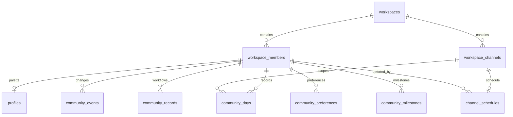

> 보관된 기능·운영 문서입니다. 현재 동작은 [문서 안내](../README.md)를 따릅니다. 아래 상태와 번호는 작성 당시 기준입니다.

# v0.0.30 운영 DB 정규화 및 이관

2026-09-11 운영 Neon PostgreSQL18에서 적용했다. Worker 배포 `c25932ae-3ffc-4f0d-8eb8-8df389b17dcd`, DB 이관 식별자 `006-007-normalization`.

## 지금의 원본

- **workspaces**: Slack workspace ID와 명시적인 공개 원씽 채널. QA 채널을 임의로 추론해 공개 잔디에 합치지 않는다.
- **workspace_members**: `(team_id,user_id)`로 식별하는 공통 회원 원장. Slack 디렉터리의 표시 이름·봇·삭제 상태·조회 시각을 연결했다. 존재하는 회원이라는 사실은 관리자/초대자/참여 자격 승인을 의미하지 않는다. 실제 가입 시각을 추측해 채우지 않는다.
- **workspace_channels**: 채널 ID 기준 원장. 회원·채널과 기존 데이터 사이에 총16개 외래키를 검증해 적용했다. 회원 삭제로 활동 이력을 연쇄 삭제하지 않는다.
- **community_days**: 회원·채널·날짜별 목표/수행 상태/후기의 유일한 운영 원본. 날짜별1목표·1후기 구조에서는 같은 키에 종속하므로 무조건 테이블을 쪼갤 필요가 없다. 정수 revision으로 수정 충돌을 막고 last_event_time은 구형 API의 시각 순서를 별도로 관리한다.
- **goals**: 더 이상 테이블이 아니다. 공개 원씽 채널의 community_days를 읽는 **조회 전용 호환 view**다. 기존 보드/구형 API와 신규 봇이 같은 내용을 읽는다. 보조 목표 테이블로 이중 저장하지 않는다.
- **profiles**: 기존 색상·시작일 설정 보존. 회원 신원/초대 자격을 대신하지 않는다.
- **channel_schedules**: 공통 안내2건을 JSON 레코드에서 채널별 타입 있는 원본으로 이동했다. 기존 getRecord/setGroupSchedule API에는 호환 응답을 제공한다.
- **community_events / community_records**: 되돌리기용 스냅샷·확인 대기·발송 중복 방지 등 기존 워크플로 이력은 보존했다. JSONB를 관계형 핵심 데이터의 무제한 대체물로 확장하지 않는다.

회원/채널이 최초 관측되면 기존 저장 경로의 INSERT trigger로 식별 원장을 등록한다. 운영 회원의 이름·봇/삭제 상태는 이번 이관에서 Slack 디렉터리8건을 동기화했다. 앞으로 상시 디렉터리 동기화 기능까지 추가된 것은 아니다.

## 데이터 보존

1. 이관 전 otl 전체를 pg_dump18로 백업했다. 버전17 도구로는 운영18 백업이 불가능함을 확인해 설치되어 있던 libpq18 도구를 사용했다.
2. 독립적인 로컬 DB에 복원 후 이관·회귀·롤백 시험을 수행했다.
3. Worker maintenance를 활성화해 신규 Slack 요청을 성공 ACK하지 않고503으로 돌렸고, 예약 실행은 재시도하도록 했다. 대기 후 최신 백업을 다시 만들었다.
4.006·007 및 무손실 검사를 **하나의 트랜잭션**으로 적용했다. 실패하면 전체 변경이 롤백된다.5초 잠금 대기 한도로 무기한 점유하지 않는다.
5. 기존 행은 잠금을 잡은 동일 트랜잭션 안에서 `otl_archive.migration_snapshots`에 보존했다. 예전 goals 테이블도 archive에 그대로 보관했다.
6. 불일치4건은 Slack 원문으로 확인했다. 빠진3개 목표는 canonical 내용을 보존했고, `hi`와 실제 목표가 충돌한1건은 원문에 맞는 canonical을 사용하며 두 값을 `goal_reconciliation`에 저장했다. 예상 밖의 충돌이나 빈 canonical 목표와 legacy 목표 충돌이면 자동 덮어쓰기 대신 이관을 중단한다.
7. 원래 목표·후기·상태·revision·변경 이력·개인 알림·워크플로 기록이 보존됐음을 SQL EXCEPT 대조로 확인했다. 공통 일정은 새 테이블의 동일 필드와 대조했다.
8. maintenance를 해제했다.9/8 완료·9/9 미완료,10시·18시 공개 일정, 구형 보드와 canonical 데이터 일치를 운영 DB에서 재조회했다.

이관 직후 기준: 회원8명, 날짜별 기록14행(QA 포함), 변경 이력20건, 공개 목표13건. 이후 정상 사용으로 증가할 수 있다. 가입자 수/실제 활동률을 이 숫자로 추정하지 않는다.

## 백업과 복구

백업 파일은 저장소 밖 `/Users/zayden/.local/share/otl1/backups/`에 디렉터리0700/덤프0600으로 보관한다. 접속 비밀번호를 명령 인자·문서·로그에 적지 않았다. 이관 전 파일 경로·SHA256은 `.omx/qa/normalization/pre-migration-backup.json`, 이관 후는 `backup.json`에 있다. 이관 후 백업은 otl과 otl_archive를 모두 포함하고 별도 로컬 DB에 복원해 확인했다.

적용 명령은 `node scripts/migrate-normalized-db.mjs --apply`다. maintenance503을 먼저 확인하며 단일 트랜잭션으로006·007과 invariant 검사를 실행한다. 같은 이관을 무조건 재실행하지 않는다. schema_migrations에 완료가 있으면 재실행은 거부되며 데이터는 바뀌지 않는다. historical002~004는 현재 정책과 다른 admission/초대 제약이 있어 자동 적용하지 않았다.

되돌릴 때는 먼저 maintenance를 활성화하고 진행 중 요청을 정리한 후 `scripts/rollback-normalization.sql`을 psql `--single-transaction -v ON_ERROR_STOP=1`로 실행한다. 이 스크립트는 **현재 canonical 기록에서** legacy 테이블을 재구성하므로 이관 뒤 새로 들어온 목표를 이전 백업으로 덮어쓰지 않는다. 개인 설정·이력·회원 관계·archive를 유지한다. 롤백 시험에서 새 목표와 누락된 palette profile 복구, 공개 목표 차이0을 확인했다. 롤백 상태는 영구 운영 목표가 아니며 원인을 수정한 후 재이관 계획이 필요하다.

## 이후 명세의 데이터 규칙

- 새 기능의 회원 키는 workspace_members를 참조한다. 별도 LinkedIn 사용자/초대 사용자 원장을 중복 생성하지 않는다.
- 목표·후기 수정은 community_days의 동일 날짜·revision에 반영하고 community_events로 이력을 남긴다. 새 목표 저장소를 만들지 않는다.
- 가이드 발행은 guide_versions, 전달은 guide_deliveries 같은 관계형 테이블로 구현하며 회원·발행본·메시지 간 FK와 중복 제한을 둔다. 아직 이 기능의 빈 테이블이나 자동 발행을 만들지는 않았다.
- LinkedIn 외부 프로필, 회사 소속 이력, 초대 관계, Silo 소속은 서로 다른 관계다. 회원 키를 공유하되 정책이 확정될 때 별도 테이블과 제약을 추가한다. 링크 등록을 본인/재직 검증으로 간주하지 않는다.
- 설정과 핵심 관계는 타입 있는 열·키·FK로 강제한다. JSONB는 이벤트 스냅샷·외부 요청/응답·버전별 불변 payload에 제한한다.
- 각 migration에 데이터 대조, 명시적 출처 우선순위, 복구 시험을 포함한다. 운영 DB 수정과 feature rollout을 구분한다. 새 기능마다 전체 원장을 다시 갈아엎지 않는다.

## 검증 범위와 남은 한계

`normalization-rehearsal.mjs`, `normalization-invariants.sql`, `normalized-legacy.mjs`, 기존 storage/scheduler 테스트를 운영 복제본에서 실행했다. 중복·역순·시계 오차·완료 목표 덮어쓰기 차단·부분 수행 유지·후기 보존·동시 revision·stale undo·개인/공개 채널 분리·palette·알림 중복 방지를 검증했다. lint·typecheck·build도 통과했다. admin-dev 실제 사용자 조회·설정 QA는 `.omx/qa/normalization/`에 보존한다.

모든 미래 도메인의3NF 설계를 완료했다는 뜻은 아니다. 현재 핵심 원본의 중복과 관계 무결성을 정리했다. 앱은 여전히 기존 DB owner 자격증명을 사용하므로, 앱 권한 검사와 별개인 최소 권한 DB role 분리는 후속 보안 과제다. 백업은 수동 스냅샷이며 자동 백업 주기·재해 복구 SLO·대규모 부하 시험은 이번 완료 범위가 아니다.

실제 사용자 QA 링크: [이관 후 상태·잔디 응답](https://onething1line.slack.com/archives/C0C0AMK8068/p1789097906267949), [공통 일정 저장 응답](https://onething1line.slack.com/archives/C0C0AMK8068/p1789098187571359). QA는 비공개 admin-dev에서 수행했고 공개 공지는 발송하지 않았다.
